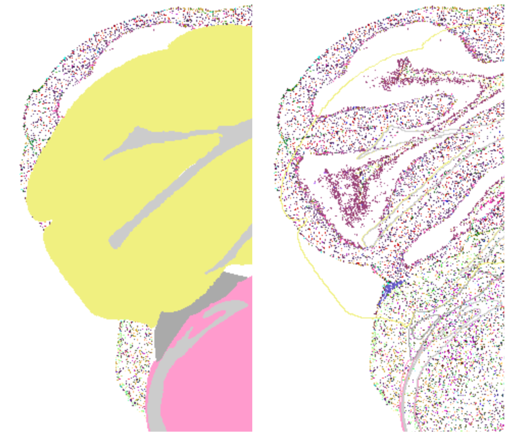

# Grounding cell-type-to-region matches in measured spatial proximity

*A CCF-based extension to the Brain Cell Knowledge Graph*

**David Osumi-Sutherland** and **Claude-Code**

---

## 1. Motivation

### The matching problem

The Brain Cell Knowledge Graph (Brain_Cell_KG) catalogues *transcriptomic*
cell types — discrete classes defined by single-cell gene expression
patterns from whole-brain MERFISH and 10x datasets. Most cell-type
descriptions in the published neuroscience literature are not phrased that
way: they refer to *anatomically* defined types — "the calbindin-positive
interneurons of CA1 stratum oriens", "GABAergic neurons of the
periaqueductal grey", "layer 5 extratelencephalic neurons of motor cortex".
Linking the two — *which transcriptomic types correspond to which
literature-described types?* — is a core task for an agentic workflow
that wants to build from prior knowledge rather than rediscover it.

Anatomical descriptions in the literature are typically location-defined,
so the match has to be grounded in *where each transcriptomic type sits in
the brain*. The Brain Cell KG already records this at the *discrete-
assignment* level: each MERFISH cell carries a `parcellation_index` from
the painted Allen CCF, and aggregated per cell type this becomes a count of
cells in each named region (the existing
[`PCL:0010063` "has soma location" edge](src/scripts/ccf_spatial/scripts/compute_unified_location_templates.py)
with `cell_count` and `cell_ratio` axiom annotations). That answers *"how
many cells of type X were observed inside region A?"*.

### Why the discrete count is not enough: misregistration is inevitable

Registering a particular animal's MERFISH sections into the Allen CCF
template means non-linearly warping the imaged anatomy onto an idealised
average brain. The warp is never perfect: published MERFISH-to-CCF
registration error is on the order of tens of micrometres per cell. So a
cell type that anatomically sits along the border between two regions will,
by registration noise alone, have many of its cells assigned to whichever
side of the boundary the warp happened to put them on. From the
discrete-count view the type can look *distributed across* a set of
substructures when it is really *concentrated at the boundary between
them* — and a literature search for "type X of region A" misses it
because most cells are recorded in the neighbouring B or C.

### The clearest evidence of misregistration is in the data itself

In the pooled Yao + Zhuang MERFISH datasets we use (9.14 M cells), about
**164 700 cells (~1.8 %) have valid `x_ccf / y_ccf / z_ccf` coordinates but
`parcellation_index = 0`** — they sit *inside* the CCF coordinate frame
yet *outside* any parcellated region. These are not unregistered cells;
they have real CCF positions. They are cells whose registered position
landed just outside the painted brain.

How far outside? On the Yao subset (68 586 such cells), the distribution of
distance from each unassigned cell to the nearest parcellated voxel is:

| percentile | distance to nearest parcellated voxel |
|---|---|
| 25 % | 24 µm |
| 50 % | 50 µm |
| 75 % | 130 µm |
| 90 % | 289 µm |
| 95 % | 429 µm |

| cumulative ≤ | fraction of unassigned cells |
|---|---|
| 50 µm | 50.1 % |
| 100 µm | **69.1 %** |
| 200 µm | 83.7 % |
| 500 µm | 96.5 % |

Half of these "outside-the-parcellation" cells sit within one MERFISH
registration-error standard (50 µm) of a parcellated voxel; over two
thirds within 100 µm. They cluster spatially at section peripheries — on
the worst-affected Yao section the unassigned cells sit on average **55 %
further from the section centroid** than the assigned ones — and they
concentrate on anterior and olfactory-bulb sections (sections 5 – 19 of
brain `638850` carry 4 – 6 % unassigned vs the 1.8 % global mean), which
is exactly where inter-animal anatomical variation is hardest for the
CCF to absorb.

Figure 1 shows the pattern on section `C57BL6J-638850.05` (5.6 %
unassigned). Cells outside any painted region appear both **(a)** in a
peripheral ring outside the brain — registered positions that fell off the
edge of the parcellated volume — and **(b)** in interior unpainted wedges
*between* named regions, e.g. the gap between CB (cerebellum) and MY
(medulla). The interior-gap cells are particularly informative because they
cannot be explained by a missing tissue scan: they are real, fully
transcriptomically-typed cells whose registered position landed in
unparcellated space inside the brain, at a CB/MY boundary that the CCF
template does not paint cleanly.



**Figure 1.** Misregistration on section `C57BL6J-638850.05` of the ABC
atlas Yao WMB MERFISH dataset (imputed genes / reconstructed coordinates
view). Coloured dots are individual cells, coloured by transcriptomic
identity. **Left panel — painted parcellation:** yellow = CB (cerebellum);
pink = MY (medulla). Substantial numbers of cells sit *outside* both
fills — both in the peripheral ring at the section boundary and in the
unpainted wedge between the two regions. **Right panel — region outlines
only, same section:** the cells in the gap between the CB outline (yellow)
and the MY outline (pink) are real, transcriptomically-typed neurons
whose registered CCF position fell in unpainted space at the CB / MY
boundary. They cannot be explained as missing tissue scans — they are
fully imaged cells whose CCF assignment is `parcellation_index = 0`. On
this section ≈ 5.6 % of cells fall in that category, against the 1.8 %
whole-brain mean.

If 1.8 % of cells are *frankly* outside the parcellation, many more are
*subtly* misassigned — in the wrong substructure but a few voxels from the
right one. A discrete count cannot reveal this; an agent reasoning from it
cannot account for it.

### The fix this work implements

We use the registered coordinates *directly* — they have been flowing
through the cell-count pipeline but, until now, had been aggregated into
discrete counts and discarded. For each cell type and each named region X,
the new layer measures:

- `countInRegion` — cells of the type whose `parcellation_index` puts them
  inside X (the existing signal), and
- `countInOrNear100um` — `countInRegion` **plus** cells of the type whose
  CCF coordinates fall within 100 µm of X's painted surface from the
  outside (the new signal).

The 100 µm band sits comfortably above MERFISH registration error and
approximates one cortical layer / a few cell-spacings — biologically a
"this type is at this region's boundary" scale. A cell that the
parcellation assigned to neighbour Y but whose CCF position is within
100 µm of X's surface still counts toward X's proximity signal. Border-
living cell types are no longer hidden behind the noise floor of
registration.

Alongside this, we emit a region-to-region adjacency layer from the
painted volume itself, so the graph carries explicit *measured* "next-to"
relations between named regions rather than relying on latent anatomy
knowledge.

The remainder of this paper describes the two outputs (region adjacency and
the unified per-type location edge), the schema we chose, the filtering
decision, and the validation patterns. The boundary-band count is carried as
an extra axiom annotation on the existing `PCL:0010063` "has soma location"
edge — one fact per (type, region) rather than two parallel edges.

## 2. Data sources

Everything reuses data that the existing pipeline already caches:

| dataset | what we use |
|---|---|
| Allen CCF 2020 annotation volume | the *painted* parcellation at 25 µm voxel resolution: every voxel labelled with a `parcellation_index` |
| `parcellation_to_parcellation_term_membership_acronym.csv` | maps `parcellation_index` → division / structure / substructure acronym |
| `reports/mba_symbol_map.csv` | acronym → [`MBA:` CURIE](http://purl.brain-bican.org/ontology/mbao/) |
| Yao WMB MERFISH (~3.7 M cells, single brain) | per-cell `x_ccf / y_ccf / z_ccf` + cluster-level taxonomy assignment |
| Zhuang ABCA MERFISH (4 brains, ~5.3 M cells) | same per-cell coordinates + taxonomy |
| `reports/cell_set_map.csv` | taxonomy label → cell-type CURIE |

Pooled: **9.14 M cells in CCF mm space**. The shared bridge that turns a
`parcellation_index` into a knowledge-graph CURIE at any of the three
hierarchical region levels lives in
[`src/utils/ccf_parcellation.py`](src/utils/ccf_parcellation.py); the
existing cell-count matrix script
[`generate_zhuang_matrices.py`](src/scripts/cell_counts/scripts/generate_zhuang_matrices.py)
was refactored to share it.

## 3. Two outputs sharing one edge

### 3.1 Region adjacency

The painted volume defines which regions abut which. For every pair of
regions whose painted territories share at least one voxel face we emit a
**`RO:0002220` "adjacent to"** edge, with axiom annotations capturing:

- `n2o:contactArea` (µm² — the shared boundary surface)
- `n2o:minDistance` (always one voxel = 25 µm for face-touching pairs)
- `n2o:centroidDistance` (µm)

Computed once per region level (division → structure → substructure) by
[`compute_region_adjacency.py`](src/scripts/ccf_spatial/scripts/compute_region_adjacency.py).
The implementation walks the volume along each of three axes in one
vectorised pass: 25 regions, 339 structures, 574 substructures, ~2 seconds.
Outputs land in [`templates/region_adjacency_{level}.tsv`](templates/) →
[`owl/region_adjacency_{level}.owl`](owl/).

### 3.2 Per-type unified location edge

For every (cell type, region X) pair we emit a single
**`PCL:0010063` "has soma location"** edge carrying up to five axiom
annotations:

| axiom annotation | property | meaning |
|---|---|---|
| `cell_count` | `PCL:0010060` (xsd:integer) | cells of the type whose painted resident region is X |
| `cell_ratio` | `PCL:0010065` (xsd:float) | `cell_count` / total cells of the type (per dataset) |
| `in_or_near_100` | `n2o:countInOrNear100um` (xsd:integer) | `cell_count` **plus** cells of the type observed within 100 µm of X's painted surface but residing outside X |
| `spatial_atlas` | `n2o:spatialReferenceAtlas` (IRI) | the spatial reference atlas the measurement was made against — currently `n2o:CCF2020` |
| `completeness` | `n2o:cellCountCompleteness` (xsd:string) | only on rollup rows (see §6): `"exact"` when X's painted territory is fully covered by CCF-canonical descendants; `"lower_bound"` when some descendants are unpainted. Directly-measured rows omit this annotation. |

This collapses what was, in an earlier iteration, two parallel edges per
(type, region) — a `PCL:0010063` "has soma location" edge and a separate
`n2o:locatedInOrNear` proximity edge — into one fact. The interior count
keeps the strict soma-location semantics; the boundary-band count carries
the "or near" registration-noise aspect alongside it.

Computed by
[`compute_unified_location_templates.py`](src/scripts/ccf_spatial/scripts/compute_unified_location_templates.py),
once per dataset (Yao / Zhuang) so the source DOI is unambiguous. Distance
from each cell to a region's surface is measured against a KD-tree built
from the region's *painted boundary voxels* — robust to MERFISH section
spacing (~100–200 µm in z; the surface is dense). The dataset's total cells
per type (the implicit denominator of `cell_ratio`) lives in the
[per-type total-cell-count template](src/scripts/cell_counts/generate_total_cell_count_template.py).

A literature-match agent reads two questions off the same edge:

- *"Is this type really there?"* → `in_or_near_100` above its noise floor.
- *"Is most of this type there?"* → `cell_ratio` close to 1, or
  `in_or_near_100 / total_cells_of_type` close to 1.

### Why 100 µm?

It sits comfortably above MERFISH per-cell registration error (tens of
micrometres) and approximates one cortical layer or a few cell-spacings —
biologically a sensible "abutting" scale.

## 4. Schema

### Each region in exactly one place

A region acronym's *native level* in the CCF hierarchy is the first column in
the membership table where it appears without a `-unassigned` suffix. `MB` is
a division, `ZI` a structure, `DG-mo` a substructure. Each (type, region) row
is emitted at the region's canonical level only, so:

- divisions (`HY`, `MB`, `Isocortex`, …) only appear in division-level rows;
- structures (`ZI`, `SNr`, `MOs`, …) only at structure-level;
- substructures (`MOs6a`, `CA1so`, …) only at substructure-level.

No region is duplicated across levels; an agent that resolves a literature
term to a CURIE pulls the edges at that CURIE's native level directly. The
canonical-level helper lives in
[`load_canonical_levels()`](src/utils/ccf_parcellation.py).

### Template row shape

Each row in `templates/{tax}_location_mappings[_zhuang].tsv` is a single
`PCL:0010063` ROBOT-template edge with the standard 9-column layout:

| col | header | ROBOT type | from |
|---|---|---|---|
| 1 | `ID` | `ID` | cell-type CURIE |
| 2 | `Type` | `TYPE` | `owl:NamedIndividual` |
| 3 | `PCL:0010063` | `AI PCL:0010063` | region CURIE (`MBA:nnn`) |
| 4 | `cell_count` | `>AT PCL:0010060^^xsd:integer` | interior count |
| 5 | `cell_ratio` | `>AT PCL:0010065^^xsd:float` | interior fraction |
| 6 | `in_or_near_100` | `>AT n2o:countInOrNear100um^^xsd:integer` | boundary-band count |
| 7 | `completeness` | `>AT n2o:cellCountCompleteness^^xsd:string` | `"exact"` or `"lower_bound"` on rollup rows; blank on directly-measured rows |
| 8 | `spatial_atlas` | `>AI n2o:spatialReferenceAtlas` | atlas individual (`n2o:CCF2020`) |
| 9 | `source` | `>AI dcterms:source` | dataset DOI |

### Boundary cells (`parcellation_index = 0`)

About **1.8 %** of cells with valid CCF coordinates sit *outside* any
parcellated region (boundary slivers, CSF). The script keeps them: their
`region_<level>` is `NaN` so they never increment `cell_count`, but they
do contribute to the per-type total (the implicit denominator of
`cell_ratio`) and to `in_or_near_100` when they fall within 100 µm of a
region surface. The alternative (drop them up-front) silently undercounts
every type and slightly inflates every fraction.

### `<X>-unassigned` cells

About **10 %** of cells at substructure granularity sit in regions like
`HY-unassigned` (hypothalamus without further annotation). These are
correctly captured *without* needing CURIEs for `-unassigned` placeholders:
the shared bridge folds them to the parent acronym, the cells appear in the
global cells KD-tree, and when queried against a canonical substructure B
nearby they classify as "near B but not in B" — contributing to
`in_or_near_100`. They also appear at the parent's canonical level (e.g. as
residents of `HY` at the division-level row), where they belong.

## 5. Filtering choice

A single emit rule survives in production: keep a (type, region) row when
the fractional share of the type's cells inside or within 100 µm of the
region clears a per-taxonomy floor.

### 5.1 The graded cutoff

| taxonomy level | floor on `in_or_near_100 / total_cells_of_type` |
|---|---|
| neurotransmitter | 0.005 (0.5 %) |
| class | 0.0075 (0.75 %) |
| subclass | 0.01 (1 %) |
| supertype | 0.015 (1.5 %) |
| cluster | 0.025 (2.5 %) |

Coarser levels spread across more regions, so a flat cutoff would
over-prune broad types (a broad subclass's hippocampal share falls below
the cluster floor even when its child clusters are clearly hippocampal).
The graded scale mirrors the existing
[`DEFAULT_GRADED_CUTOFFS`](src/scripts/ccf_spatial/scripts/compute_unified_location_templates.py)
matches what the prior `cell_count`-only template used, so KG consumers see
the same emit-decision behaviour they tuned to.

### 5.2 Why one cutoff, not an OR

The previous draft applied an OR rule
(`count ≥ 10`  **OR**  `frac ≥ 0.05`) to preserve two distinct match
patterns: small focal clusters (fraction branch) and broad clusters with
significant absolute presence (count branch). With the unified edge, the
boundary-band count `in_or_near_100` itself rescues the focal-edge case:
a 96-cell cluster all of whose cells sit at ZI clears the cluster-level
2.5 % floor on `in_or_near_100 / total` trivially (96 / 96 = 1.0), even
when only 88 of those cells are strictly *in* ZI. The broad-cluster case is
covered by the lower coarse-level floors. The two branches collapse into
one rule once the denominator and numerator both account for the boundary
band.

### 5.3 What we deliberately do not filter

We considered, and dropped, a further filter on a *local* denominator —
counting cells of the type that live in regions adjacent to B — because it
silently drops small focal clusters whose home is the only region they
appear in. The global per-type total is the only denominator used.

## 6. Examples

All examples below show pooled Yao + Zhuang numbers for readability (the
production pipeline runs per-dataset; the OWL templates carry the same
`cell_count` / `cell_ratio` / `in_or_near_100` values as axiom annotations,
one DOI per edge). The inspection CSV
[`reports/cell_proximity_*.csv`](reports/) carries the same columns plus
the per-row total used as denominator.

### 6.1 Focal exact-match: large type, one home

**`037 DG Glut`** — the dentate-gyrus granule-cell glutamatergic subclass
(57 357 cells in Yao alone; 91 692 pooled).

| level | near | n_total | n_in_X | n_in_or_near_100 | frac_in_or_near_100 |
|---|---|---|---|---|---|
| division | `HPF` (hippocampal formation) | 91 692 | 90 373 | 91 290 | **0.996** |
| substructure | `DG-mo` (DG molecular layer) | 91 692 | 11 881 | 74 319 | **0.811** |

Lit search for "hippocampal granule cell" pulls the division edge: 99.6 % of
this subclass lives in HPF — strongest possible match. Search for "DG
molecular layer" pulls the substructure edge: 81 % of the subclass is *in or
within 100 µm of* DG-mo (most cells sit one layer deep in DG-sg, the granule
layer, which abuts DG-mo).

### 6.2 Focal small cluster — preserved by the graded cutoff

**`1728 ZI Pax6 Gaba_2`** — a 96-cell cluster name-tagged as a zona
incerta Pax6 GABAergic type.

| level | near | n_total | cell_count | in_or_near_100 | frac_in_or_near_100 |
|---|---|---|---|---|---|
| division | `HY` (hypothalamus) | 96 | 95 | 96 | **1.000** |
| structure | `ZI` (zona incerta) | 96 | 88 | 96 | **1.000** |

Every one of this cluster's 96 cells lives in or within 100 µm of ZI.
Although the absolute count is small, the fractional share is 1.0 and
clears the cluster-level 2.5 % floor by an enormous margin. The earlier
draft worried that an absolute-count floor would erase rows like this; the
graded fractional rule keeps them by construction.

### 6.3 Broad distributed type — covered by lower coarse-level floors

**`0364 L5 ET CTX Glut_2`** — a layer-5 extratelencephalic cortical
glutamatergic cluster (12 832 cells across pooled Yao + Zhuang).

| level | near | cell_count | in_or_near_100 | frac_in_or_near_100 |
|---|---|---|---|---|
| division | `Isocortex` | 12 826 | 12 828 | **1.000** |
| structure | `MOs` (secondary motor) | 2 943 | 3 749 | 0.292 |
| structure | `MOp` (primary motor) | 2 594 | 3 340 | 0.260 |
| structure | `ACAd` (anterior cingulate, dorsal) | 862 | 1 347 | 0.105 |
| structure | `SSp-ll` (somatosensory, lower limb) | 945 | 1 342 | 0.105 |
| structure | `SSp-ul` (somatosensory, upper limb) | 868 | 1 271 | 0.099 |
| substructure | `MOs5` | 1 702 | 2 996 | 0.233 |
| substructure | `MOp5` | 1 638 | 2 852 | 0.222 |
| substructure | `MOs6a` | 1 234 | 2 736 | 0.213 |
| substructure | `MOp6a` | 953 | 2 417 | 0.188 |
| substructure | `SSp-ll5` | 872 | 1 323 | 0.103 |

Reading these together (the broad-match pattern): every cell of this
cluster is cortical (division: `Isocortex` = 1.0), distributed across
motor and somatosensory areas (structure), specifically in deep cortical
layers 5/6a (substructure). No single edge is *the* match — the family
of edges describes the type. Several of these rows have
`frac_in_or_near_100` around 0.1; they clear their respective floors
(structure 0.75 %, substructure 2.5 %) comfortably. The graded scale is
what lets the structure-level rows past while still trimming
sub-percent noise at cluster level.

### 6.4 Border-only — the case proximity exists to capture

**`3550 PAG-ND-PCG Onecut1 Gaba_3`** — a 120-cell cluster name-tagged to
PAG / ND / PCG.

| level | near | cell_count | in_or_near_100 | frac_in_or_near_100 |
|---|---|---|---|---|
| division | `P` (pons) | 99 | 110 | **0.917** |
| structure | `PCG` (pontine central grey) | 38 | 85 | **0.708** |
| structure | `DTN` (dorsal tegmental nucleus) | 56 | 79 | 0.658 |
| division | `MB` (midbrain) | 19 | 27 | 0.225 |
| structure | `PDTg` (posterodorsal tegmental nucleus) | 0 | 24 | 0.200 |
| structure | `PAG` (periaqueductal grey) | 13 | 19 | 0.158 |

Only 38 of the 120 cells are *in* PCG (32 %). By `cell_count` alone the
cluster looks more DTN than PCG. The unified edge reveals that **85 of
the 120 cells (71 %) sit within 100 µm of PCG's painted surface** — the
cluster lives squarely on the PCG / DTN boundary. The taxonomy name's
inclusion of PCG is substantively correct, and only the `in_or_near_100`
annotation surfaces it. Note also `PDTg`: `cell_count = 0` but 24 cells
within 100 µm (20 % of the cluster). With only the `cell_count` column
this row would have been dropped entirely (no cells inside the region);
under the unified schema the boundary-band fraction (0.200) clears the
cluster-level 2.5 % floor and the edge is retained — the headline
behaviour the unification was built to deliver.

### 6.5 Boundary-band rescue — the pattern across small clusters

§6.4 shows one boundary-only case (PAG-ND-PCG Onecut1 Gaba_3 × PDTg).
The pattern recurs across many small focal clusters whose
registered cells land just outside the painted territory of an
anatomically-relevant region. A handful of cases from the Yao build
(`reports/cell_proximity_cluster.csv`):

| cluster | near | level | n_total | cell_count | in_or_near_100 | frac_in_X | frac_band |
|---|---|---|---|---|---|---|---|
| `3802 SCsg Gabrr2 Gaba_1` | `SCop` (superior colliculus, optic) | substructure | 5 | 0 | 5 | 0.000 | **1.000** |
| `3901 MB-MY Tph2 Glut-Sero_3` | `PAG` (periaqueductal grey) | structure | 8 | 0 | 7 | 0.000 | **0.875** |
| `3248 SCig-an-PPT Foxb1 Glut_1` | `SCiw` (SC, intermediate white) | substructure | 14 | 1 | 11 | 0.071 | **0.786** |
| `1668 AHN-SBPV-PVHd Pdrm12 Gaba_5` | `PVa` (periventricular hypothalamic, anterior) | structure | 24 | 2 | 22 | 0.083 | **0.917** |

These rows would all have been **dropped** by a strict-`cell_count`-only
schema (no cells inside the painted region) or downweighted to noise by
a coarse "boundary discount" heuristic. Under the unified schema each
row clears its level's graded cutoff via the band fraction alone, and
the agent sees a clean signal that the cluster lives at the region's
anatomical address even when registration has scattered its cells to
the wrong side of the painted boundary.

These four cases were spot-checked from the historical small-cluster
exploration table; many more exist in the cluster CSV across the
hippocampal, brainstem and superior-colliculus regions, all sharing the
same shape (small `n_total`, `frac_in_X` near zero, `frac_band` near
one).

## 7. Reaching MBA terms that are not directly painted in CCF

### 7.1 The problem

Some anatomy terms an agent will encounter in the literature do not appear
as painted regions in the CCF parcellation. The canonical case is
**Entorhinal area** (`MBA:909`, ENT): it exists as a node in the MBA
ontology, but CCF paints only its lateral and medial parts (`ENTl` /
`ENTm` at structure level, plus their layer-resolved substructures). No
voxel in the volume carries the bare acronym `ENT`. Searching the
location templates for `MBA:909` returns nothing.

Pooled MBA × CCF closure (one row per MBA term, derived by
[`src/cypher/mba_ccf_membership.cypher`](src/cypher/mba_ccf_membership.cypher)
against the live KG) gives the breakdown:

| status | MBA terms | example |
|---|---|---|
| directly painted in CCF (CCF level label set) | **568** | `ENTl`, `ZI`, `MOs6a` |
| not painted, but every subtree leaf is painted | **59** | `ENT` = `ENTl` ∪ `ENTm`, no `<ENT>-unassigned` |
| not painted, some painted descendants + some unpainted leaves | **24** | coarse anatomical groupings mixing painted and unpainted territories |
| not painted, no painted descendants anywhere in subtree | **87** | deep MBA terms CCF did not paint at any granularity |

The downstream agent needs to be able to (a) read a location signal for
the 59 + 24 cases, and (b) tell apart "no cells of this type here" from
"no spatial information available for this region" for the 87 case.

### 7.2 Atlas individual

The Allen CCF 2020 painted parcellation is reified as a named individual
in the KG, [`templates/atlases.tsv`](templates/atlases.tsv):

```turtle
n2o:CCF2020 a n2o:SpatialReferenceAtlas ;
    rdfs:label  "Allen Mouse Brain CCF v3 painted parcellation"@en ;
    dcterms:source <https://doi.org/10.1016/j.cell.2020.04.007> ;
    n2o:atlasVersionTag  "Allen-CCF-2020/20230630" ;
    n2o:dataSource <https://allen-brain-cell-atlas.s3.us-west-2.amazonaws.com/metadata/Allen-CCF-2020/20230630/> .
```

Every `PCL:0010063` and `RO:0002220` edge in the spatial layer carries a
`n2o:spatialReferenceAtlas` axiom annotation pointing at this individual,
so each measurement explicitly declares which atlas it was made against.
Adding a second atlas (CCF v4, DHBA, HBA) is one extra row in
`atlases.tsv` plus a per-atlas membership cypher; the schema does not
need to change.

### 7.3 Per-MBA-term atlas-membership edges

Exactly one of three edges is emitted per (MBA term, atlas) pair, derived
from the closure cypher:

| edge | axiom annotation | when emitted | count |
|---|---|---|---|
| `n2o:paintedIn` → `n2o:CCF2020` | `n2o:atlasLevel` ∈ {"division","structure","substructure"} | term carries a CCF level label | **568** |
| `n2o:descendantsPaintedIn` → `n2o:CCF2020` | `n2o:descendantCoverage` ∈ {"complete","partial"} | term has CCF-canonical descendants but no direct CCF label | **83** |
| `n2o:notRepresentedIn` → `n2o:CCF2020` | (none) | term has no CCF-canonical descendants anywhere in its subtree | **87** |

Generated by
[`generate_anatomy_atlas_membership_templates.py`](src/scripts/ccf_spatial/scripts/generate_anatomy_atlas_membership_templates.py)
into three sibling ROBOT templates. The script is ontology- and
atlas-agnostic — a future DHBA × CCF v4 build reuses it with different
prefixes.

The `n2o:notRepresentedIn` edge is the schema's positive answer to "no
spatial signal possible for this term", distinct from the absence of any
spatial edge (which could mean either "no signal" or "computation hasn't
been run").

### 7.4 Rollup `PCL:0010063` rows

For every MBA term with `descendant_coverage ∈ {"complete","partial"}` the
pipeline emits a set of `PCL:0010063` rows alongside the directly-measured
ones in the same `templates/{tax}_location_mappings[_zhuang].tsv` file.
The rollup row's region URI is the **parent** MBA term (e.g. `MBA:909`,
`ENT`), and `cell_count` / `in_or_near_100` are computed by:

1. **Merging the painted territory** — union the voxel masks of every
   CCF-canonical descendant of the parent term. For `ENT` that is
   `ENTl` ∪ `ENTm`, expanded down to the full set of painted layer
   substructures via the parcellation membership table.
2. **Re-deriving the surface** — erode the merged mask by one voxel to
   get the parent term's *merged* painted boundary surface. Adjacent
   sibling boundaries that were interior to the parent's territory are
   eliminated by the merge; only the outer surface remains.
3. **Re-querying the global cells KD-tree** with the merged surface
   points → boundary-band cells within 100 µm.
4. **Interior cells** = union over the descendant CURIE sets at each
   descendant's canonical level (`region_<lvl>` columns already on the
   cells DataFrame from the canonical-level pass).
5. **Per-taxonomy graded cutoff** identical to the directly-measured pass.

Each rollup row carries a `n2o:cellCountCompleteness` axiom annotation:

- `"exact"` when descendant coverage is `complete` — the rollup is the
  full count over the parent's anatomical territory.
- `"lower_bound"` when coverage is `partial` — some descendants of the
  parent term aren't painted in CCF, so their cells are folded into an
  ancestor's `<ancestor>-unassigned` bucket and are not recoverable at
  the parent's granularity. The rollup gives a floor on the true count.

Directly-measured rows omit `cellCountCompleteness` entirely; absence
implies `exact`-by-construction.

Volume produced by the rollup pass against pooled Yao + Zhuang data:

| taxonomy level | rollup edges (Yao) | rollup edges (Zhuang) |
|---|---|---|
| neurotransmitter | 301 | 282 |
| class | 772 | 764 |
| subclass | 5 193 | 5 130 |
| supertype | 15 717 | 15 803 |
| cluster | 56 492 | 55 842 |
| **total per dataset** | **78 475** | **77 821** |

Rollup growth at cluster level is ~66 % over directly-measured rows
(rollup MBA terms are coarser than typical CCF leaves and match more
cell types per region).

### 7.5 Worked example — `MBA:909` (ENT)

For cluster `WMB:CS20230722_CLUS_0002` in the Yao build:

| level | region | cell_count | in_or_near_100 | completeness | source |
|---|---|---|---|---|---|
| structure (direct) | `MBA:918` ENTl | 69 | 122 | *(blank)* | Yao |
| structure (direct) | `MBA:926` ENTm | (below cutoff at this level) | — | — | — |
| rollup | `MBA:909` ENT | 69 | 122 | `exact` | Yao |

For this particular cluster every cell is in `ENTl` (none in `ENTm`), so
the rollup row's counts coincide with the `ENTl` row's. Other clusters
that distribute across both lateral and medial entorhinal sub-regions
will show a strict sum at the `ENT` rollup row — and crucially that row
exists at all, where in the prior schema the agent had no signal for
`MBA:909` whatsoever.

### 7.6 Agent decision tree

For a literature-resolved region CURIE *X*, the spatial-signal lookup is:

1. Does *X* carry `n2o:paintedIn n2o:CCF2020`? → read its `PCL:0010063`
   edges at the level named by `n2o:atlasLevel`. **Authoritative.**
2. Does *X* carry `n2o:descendantsPaintedIn n2o:CCF2020`?
   → read its `PCL:0010063` rollup rows.
   - `cellCountCompleteness = "exact"` → authoritative.
   - `cellCountCompleteness = "lower_bound"` → use with awareness that
     unpainted descendant territory is unmeasured at this granularity.
3. Does *X* carry `n2o:notRepresentedIn n2o:CCF2020`? → no spatial signal
   available; step up to the nearest `paintedIn` ancestor of *X*, accept
   reduced specificity, and document the fallback.

The three cases are mutually exclusive and exhaustive over all MBA terms
in the KG, so an agent can decide its strategy with a single property
query.

## 8. Validation

End-to-end checks against the pooled run:

- **Bridge coverage**: every non-zero `parcellation_index` in the volume
  resolves to an MBA CURIE.
- **Alignment self-check**: 88–90 % of 20 000 sampled cells land in their
  assigned region's voxels under the canonical relabel
  (cells in `-unassigned` substructure territories naturally fail this
  check, accounting for the gap).
- **Adjacency spot-checks**: HPF↔TH, HPF↔CTXsp, Isocortex↔OLF, CB↔MB all
  present with substantial contact areas.
- **DOI attribution**: each edge carries exactly one source DOI (the
  dataset the script was run for). Yao and Zhuang templates coexist as
  separate files so a downstream consumer can pick either set or merge.
- **ROBOT compilation**: all 13 spatial templates (3 adjacency + 5 Yao +
  5 Zhuang location) compile end-to-end through the OFN-serialising
  pipeline; cluster OWL builds in ~13 s.

## 9. Implementation

| concern | code |
|---|---|
| volume → region CURIE bridge (shared) | [`src/utils/ccf_parcellation.py`](src/utils/ccf_parcellation.py) |
| region adjacency | [`src/scripts/ccf_spatial/scripts/compute_region_adjacency.py`](src/scripts/ccf_spatial/scripts/compute_region_adjacency.py) |
| unified per-type location templates + rollup pass | [`src/scripts/ccf_spatial/scripts/compute_unified_location_templates.py`](src/scripts/ccf_spatial/scripts/compute_unified_location_templates.py) |
| MBA × atlas closure (run against live KG) | [`src/cypher/mba_ccf_membership.cypher`](src/cypher/mba_ccf_membership.cypher) |
| MBA × atlas membership templates (generic emitter) | [`src/scripts/ccf_spatial/scripts/generate_anatomy_atlas_membership_templates.py`](src/scripts/ccf_spatial/scripts/generate_anatomy_atlas_membership_templates.py) |
| atlas individual (hand-curated) | [`templates/atlases.tsv`](templates/atlases.tsv) |
| build orchestration | targets `ccf-region-adjacency`, `yao-location-templates`, `zhuang-location-templates`, `mba-atlas-membership-templates`, `ccf-spatial` in the [Makefile](Makefile) |
| KG configuration | per-level OWL URLs in [`config/collectdata/vfb_fullontologies.txt`](config/collectdata/vfb_fullontologies.txt) |

OWL outputs are serialised in OWL Functional Syntax (OFN) with the `.owl`
extension; the OWL API auto-detects format from content. This keeps every
generated `.owl` under the 100 MB git per-file limit while remaining a
drop-in replacement at every downstream consumer.

## 10. Limitations and next steps

- **Distance bands**: only the 100 µm band is emitted. A future revision
  could add 50 µm and 200 µm as additional `n2o:countInOrNearXum`
  annotations on the same edge if downstream queries want finer or coarser
  thresholds. The pipeline already has the infrastructure to compute them.
- **Human atlas**: the Allen mouse CCF is the only painted volume in scope
  here. The Developing Human Brain Atlas (DHBA v2) under Allen's CCF-MAP
  framework will need a separate pass with its own hierarchy and an
  equivalent shared bridge.
- **Region-region adjacency tolerance**: the current adjacency layer emits
  face-touching pairs only. A second pass could capture pairs separated by
  thin (≤ 50 µm) intervening territories (typically fibre tracts and CSF
  spaces), but in the mouse the resulting set is small.
